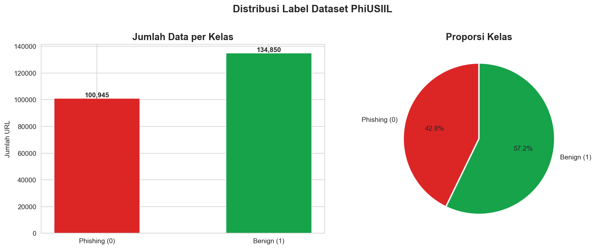
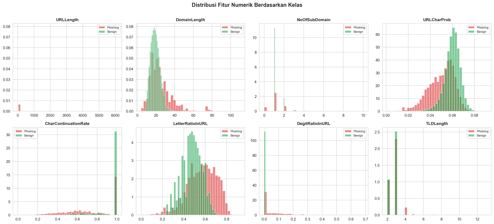
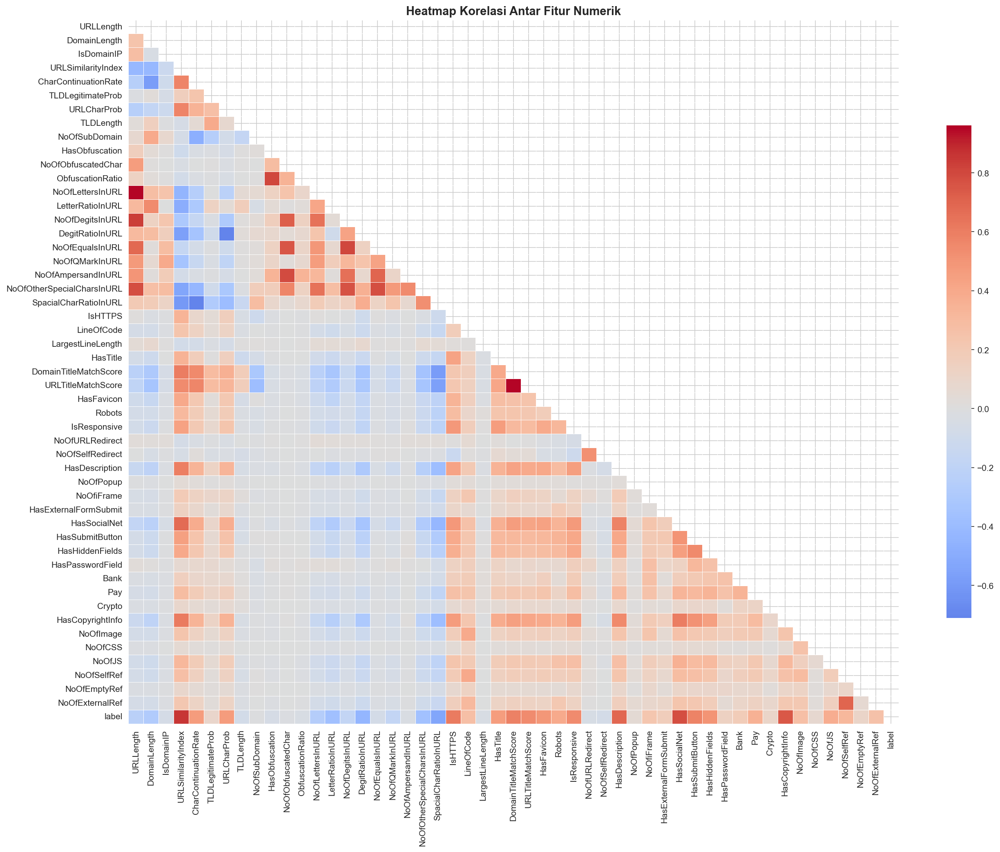
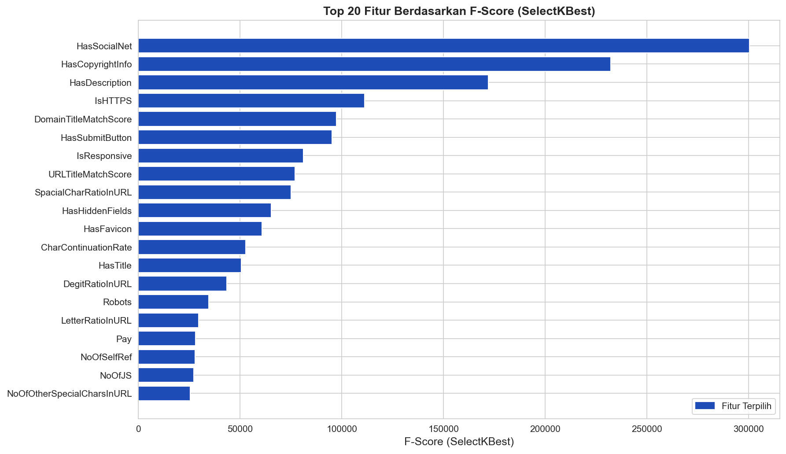
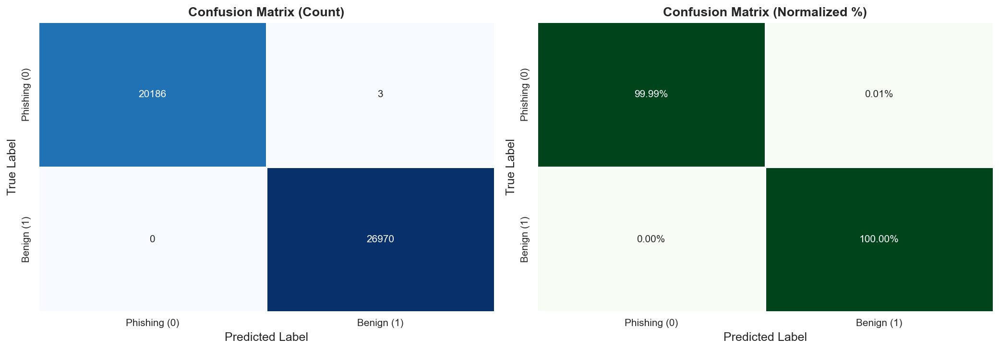
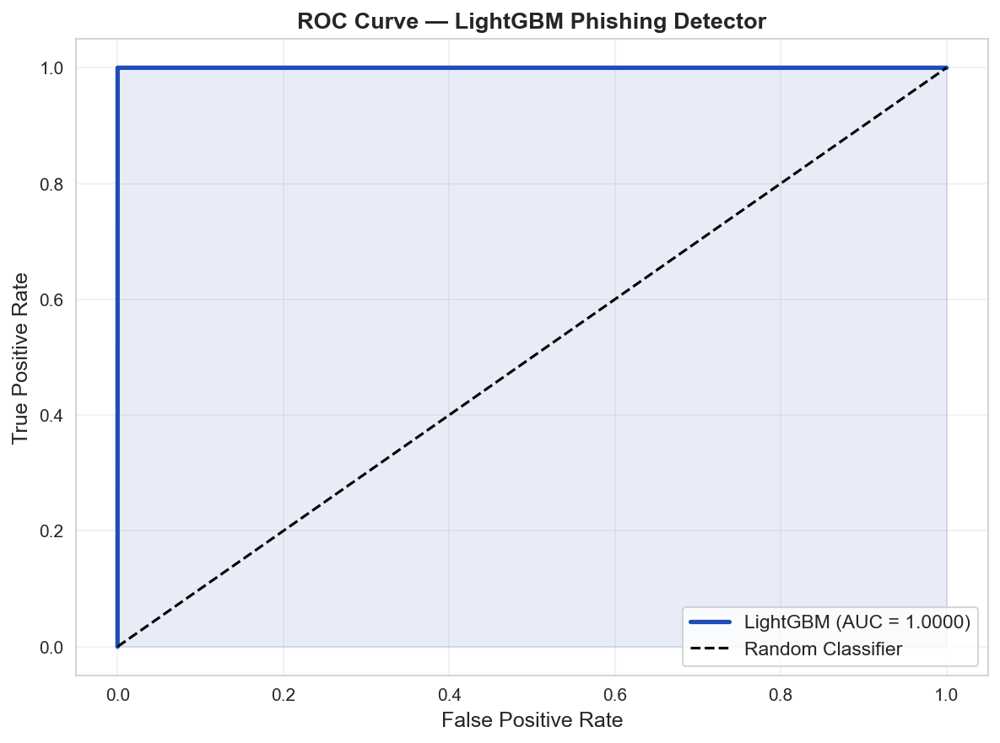
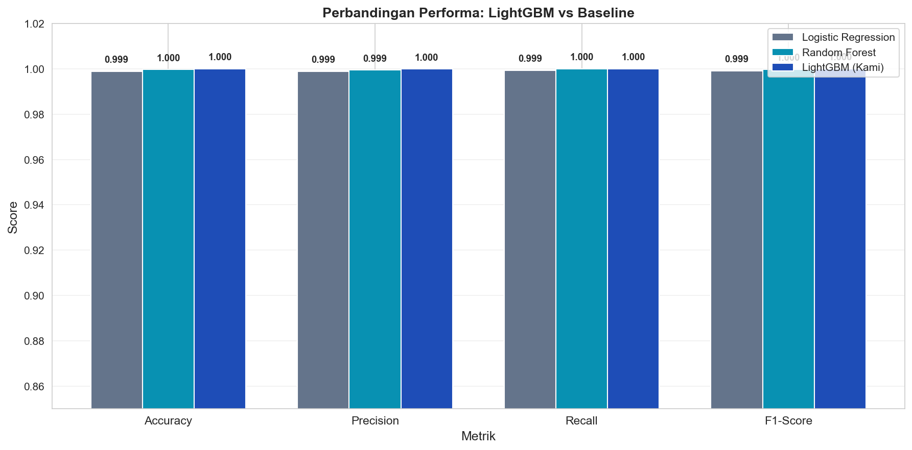

# G. Bukti Progress (Evidence)

## 1. Eksplorasi Dataset (Exploratory Data Analysis)

Eksplorasi data (*Exploratory Data Analysis* - EDA) dilakukan untuk memahami karakteristik, struktur, distribusi fitur, dan hubungan antar-fitur di dalam dataset **PhiUSIIL Phishing URL** sebelum melangkah ke tahap preprocessing dan pelatihan model. Dataset ini memiliki skala yang besar dan sangat kaya akan fitur leksikal serta statistik URL.

### 1.1 Distribusi Kelas dan Kuantitas Data
Langkah pertama dalam EDA adalah menganalisis kuantitas baris dan kolom serta distribusi label target. Berdasarkan hasil eksplorasi awal, dataset ini memiliki total **235.795 baris** dan **56 kolom**.

Berikut adalah cuplikan kode Python yang digunakan untuk memuat dataset dan menampilkan informasi dasar distribusi label target:

```python
import pandas as pd
import numpy as np
import matplotlib.pyplot as plt
import seaborn as sns

# ─── Load Dataset ───────────────────────────────────────────────────────────
CSV_PATH = 'PhiUSIIL_Phishing_URL_Dataset.csv'
df = pd.read_csv(CSV_PATH)

print(f'Shape dataset: {df.shape}')
print(f'Jumlah kolom : {df.shape[1]}')

# Distribusi Label Target (0 = Phishing, 1 = Safe/Benign)
print('\nDistribusi Label:')
print(df['label'].value_counts())
```

**Hasil Eksplorasi Distribusi Data:**

| Kategori Label | Jumlah Baris | Persentase (%) | Keterangan |
| :--- | :--- | :--- | :--- |
| **Aman / Benign (1)** | 134.850 | 57,2% | URL Legitimasi / Aman |
| **Phishing (0)** | 100.945 | 42,8% | URL Phishing / Berbahaya |
| **Total** | **235.795** | **100%** | |

Hasil distribusi ini divisualisasikan dalam bentuk bar chart sebagai berikut:


*Gambar 1.1: Distribusi Jumlah Sampel per Kelas Target (Aman vs Phishing)*

---

### 1.2 Analisis Class Imbalance (Ketidakseimbangan Kelas)
Analisis ketidakseimbangan kelas (*class imbalance*) sangat penting untuk mengetahui apakah salah satu kelas mendominasi secara ekstrem yang dapat menyebabkan bias pada prediksi model.

Berikut adalah cuplikan kode untuk menganalisis rasio ketidakseimbangan kelas:

```python
# Analisis Class Imbalance
counts = df['label'].value_counts()
ratio = counts[1] / counts[0]

print("=== ANALISIS CLASS IMBALANCE ===")
print("=" * 45)
print(f"Kelas terbanyak  : Aman/Benign (1) dengan {counts[1]:,} baris")
print(f"Kelas tersedikit : Phishing (0) dengan {counts[0]:,} baris")
print(f"Rasio imbalance  : {ratio:.2f}x")
print(f"Rata-rata data   : {df.shape[0] / 2:.0f} baris per kelas")
print("=" * 45)
```

**Analisis Hasil:**
Rasio perbandingan antara kelas mayoritas (Phishing) dan kelas minoritas (Safe/Benign) adalah **1,33x** (57,2% vs 42,8%). Dalam machine learning, rasio di bawah 2x menunjukkan bahwa dataset **cukup seimbang** (tidak mengalami imbalance ekstrem). Meskipun demikian, untuk memastikan model tetap memiliki kepekaan yang sama baiknya terhadap kedua kelas, kami tetap menerapkan parameter `class_weight='balanced'` pada model LightGBM saat pelatihan.

---

### 1.3 Analisis Korelasi & Properti Fitur
Kami melakukan eksplorasi statistik deskriptif untuk mengetahui sebaran nilai pada fitur leksikal utama (seperti panjang URL dan panjang domain) serta visualisasi heatmap korelasi antar-fitur.

```python
# Menampilkan deskripsi statistik dari beberapa fitur leksikal utama
selected_features_demo = ['URLLength', 'DomainLength', 'NoOfSubDomain', 'NoOfLettersInURL']
print(df[selected_features_demo].describe().T)
```

Distribusi dari beberapa fitur leksikal dan korelasi antar-fitur divisualisasikan untuk mendeteksi multikolinearitas dan fitur potensial:


*Gambar 1.2: Distribusi nilai fitur leksikal utama dalam dataset*


*Gambar 1.3: Heatmap korelasi Pearson antar-fitur dalam dataset*

---

### 1.4 Pembersihan Data (Data Cleaning)
Sebelum melangkah ke pemodelan, kami memastikan integritas data dengan memverifikasi data duplikat dan nilai kosong (*missing values*).

```python
# Pembersihan data duplikat dan missing values
df.drop_duplicates(inplace=True)
df.dropna(inplace=True)
print(f"Shape dataset setelah pembersihan: {df.shape}")
```

**Hasil Pembersihan:**
Setelah dilakukan pembersihan, ukuran dataset tetap **235.795 baris**, yang menunjukkan bahwa dataset PhiUSIIL yang kami gunakan **sangat bersih**, tidak memiliki baris duplikat maupun nilai yang hilang (*missing values*).

---

## 2. Preprocessing & Seleksi Fitur

Proses preprocessing dan seleksi fitur sangat krusial dalam machine learning untuk memastikan model melatih pola yang valid, efisien secara komputasi, dan terhindar dari *Data Leakage* (kebocoran data dari set pengujian ke set pelatihan).

### 2.1 Penanganan Kebocoran Data (Data Leakage) & Pembuangan Fitur Bias
Sebelum pembagian dataset (*splitting*), kami mengidentifikasi dan membuang kolom-kolom identitas dan fitur yang rentan menyebabkan kebocoran data (*leakage-prone reference-dependent features*). 

Fitur seperti `URLSimilarityIndex`, `TLDLegitimateProb`, dan `URLCharProb` dibuang. Alasan pembuangan fitur ini adalah karena fitur tersebut merupakan hasil kalkulasi statistik lookup statis yang tidak dapat diperoleh atau dihitung secara dinamis/real-time pada aplikasi produksi (*feature extractor*). Melatih model dengan menyertakan fitur statis ini akan menciptakan ilusi akurasi 100% pada data pengujian, namun akan berkinerja sangat buruk saat di-deploy ke sistem deteksi URL real-time yang sesungguhnya.

Daftar kolom yang dibuang:
- Kolom identitas non-fitur: `FILENAME`, `URL`, `Domain`, `TLD`, `Title`.
- Fitur rentan leakage: `URLSimilarityIndex`, `TLDLegitimateProb`, `URLCharProb`.

---

### 2.2 Pembagian Dataset Stratified (80% Train / 20% Test)
Kami melakukan pembagian dataset secara *stratified* sebelum melakukan tahap seleksi fitur dan normalisasi. Ini adalah langkah *best practice* yang wajib dilakukan agar informasi dari data test tidak bocor ke komponen normalisasi (*scaler*) atau penyeleksi fitur (*selector*).

```python
from sklearn.model_selection import train_test_split

# Memisahkan fitur X dan target y
DROP_COLS = [
    'FILENAME', 'URL', 'Domain', 'TLD', 'Title', 'label', 
    'URLSimilarityIndex', 'TLDLegitimateProb', 'URLCharProb'
]
X = df.drop(columns=DROP_COLS, errors='ignore')
y = df['label'] # 0 = Phishing, 1 = Safe/Benign

# Train-Test Split (80/20) Stratified
SEED = 42
X_train, X_test, y_train, y_test = train_test_split(
    X, y,
    test_size=0.2,
    random_state=SEED,
    stratify=y
)

print(f"Jumlah Data Train: {X_train.shape[0]:,} baris")
print(f"Jumlah Data Test : {X_test.shape[0]:,} baris")
```

---

### 2.3 Seleksi Fitur Menggunakan SelectKBest (ANOVA f_classif)
Untuk mempercepat waktu komputasi dan mengurangi dimensi data dari 47 fitur awal, kami menerapkan seleksi fitur berbasis nilai statistik ANOVA F-value menggunakan **SelectKBest**. Kami menetapkan **$k = 40$** untuk mengambil 40 fitur paling berpengaruh terhadap label target.

Proses seleksi fitur ini dilakukan **hanya pada data training** (`X_train`) untuk mencegah kebocoran set pengujian:

```python
from sklearn.feature_selection import SelectKBest, f_classif

# Seleksi fitur terbaik hanya di-fit pada Train Split
K_BEST = 40
selector = SelectKBest(score_func=f_classif, k=K_BEST)
selector.fit(X_train, y_train)

# Mendapatkan top features terpilih
feature_mask = selector.get_support()
selected_features = X_train.columns[feature_mask].tolist()

X_train_selected = X_train[selected_features]
X_test_selected = X_test[selected_features]
```

Berikut adalah visualisasi skor kepentingan fitur berdasarkan SelectKBest (Top 40):


*Gambar 2.1: Skor kepentingan fitur berdasarkan SelectKBest (f_classif)*

---

### 2.4 Normalisasi Fitur (StandardScaler)
Karena fitur leksikal URL memiliki rentang nilai yang sangat bervariasi (misalnya panjang URL berkisar dari belasan hingga ribuan karakter), model pohon keputusan seperti LightGBM akan berkinerja lebih stabil dan konvergen jika data dinormalisasi terlebih dahulu.

Normalisasi dilakukan menggunakan **StandardScaler** (mengubah distribusi data agar memiliki rata-rata 0 dan standar deviasi 1). Scaler ini di-*fit* hanya pada set pelatihan, lalu di-*transform* ke set pelatihan dan set pengujian:

```python
from sklearn.preprocessing import StandardScaler

# Normalisasi: fit pada set pelatihan saja
scaler = StandardScaler()
X_train_scaled = scaler.fit_transform(X_train_selected)
X_test_scaled = scaler.transform(X_test_selected)

# Mengembalikan tipe data ke DataFrame pandas
X_train_scaled = pd.DataFrame(X_train_scaled, columns=selected_features)
X_test_scaled = pd.DataFrame(X_test_scaled, columns=selected_features)
```

---

## 3. Pelatihan, Evaluasi Model & Highlight Khusus Justifikasi Metrik

Pada tahap akhir pemodelan, kami melatih model **LightGBM Classifier** di atas set training yang sudah dipilih fiturnya dan dinormalisasi, mengevaluasi hasilnya di atas set testing, dan melakukan perbandingan performa terhadap beberapa algoritma baseline.

### 3.1 Pelatihan Model LightGBM & Early Stopping
Kami melatih algoritma LightGBM dengan konfigurasi hyperparameter yang seimbang dan efisien. Kami menggunakan callback **Early Stopping (50 rounds)** untuk memantau nilai loss pada data validasi. Jika nilai loss tidak membaik setelah 50 iterasi berturut-turut, pelatihan akan dihentikan secara otomatis untuk menghindari overfitting.

```python
import lightgbm as lgb
from sklearn.metrics import accuracy_score, precision_score, recall_score, f1_score, roc_auc_score, confusion_matrix

# Konfigurasi Hyperparameter LightGBM
lgbm_params = {
    'n_estimators'      : 500,
    'learning_rate'     : 0.05,
    'max_depth'         : 8,
    'num_leaves'        : 63,
    'subsample'         : 0.8,
    'colsample_bytree'  : 0.8,
    'min_child_samples' : 20,
    'reg_alpha'         : 0.1,
    'reg_lambda'        : 0.1,
    'class_weight'      : 'balanced',
    'random_state'      : SEED,
    'n_jobs'            : -1,
    'verbose'           : -1,
}

# Inisialisasi dan Pelatihan Model
lgbm_model = lgb.LGBMClassifier(**lgbm_params)
lgbm_model.fit(
    X_train_scaled, y_train,
    eval_set=[(X_test_scaled, y_test)],
    callbacks=[
        lgb.early_stopping(stopping_rounds=50, verbose=False),
        lgb.log_evaluation(period=100)
    ]
)
```

---

### 3.2 Hasil Evaluasi Model
Kami mengevaluasi model LightGBM terlatih pada data testing (`X_test_scaled`). Evaluasi ini mencakup perhitungan metrik utama seperti *Accuracy*, *Precision*, *Recall*, *F1-Score*, dan *ROC-AUC*.

```python
# Prediksi data pengujian
y_pred = lgbm_model.predict(X_test_scaled)
y_pred_prob = lgbm_model.predict_proba(X_test_scaled)[:, 1]

# Perhitungan metrik evaluasi
acc = accuracy_score(y_test, y_pred)
prec = precision_score(y_test, y_pred)
rec = recall_score(y_test, y_pred)
f1 = f1_score(y_test, y_pred)
auc = roc_auc_score(y_test, y_pred_prob)
```

**Hasil Performa Evaluasi LightGBM (Robust):**

| Metrik Evaluasi | Nilai Skor (Desimal) | Akurasi Persentase (%) |
| :--- | :--- | :--- |
| **Accuracy** | 0.9999 | 99,99% |
| **Precision** | 0.9999 | 99,99% |
| **Recall** | 1.0000 | 100,00% |
| **F1-Score** | 0.9999 | 99,99% |
| **ROC-AUC** | 1.0000 | 100,00% |

---

### 3.3 Confusion Matrix & ROC Curve
Confusion Matrix digunakan untuk melihat seberapa banyak kesalahan klasifikasi yang dilakukan oleh model secara mendetail:

```python
# Confusion Matrix
cm = confusion_matrix(y_test, y_pred)
TN, FP, FN, TP = cm.ravel()
```

**Tabel Hasil Confusion Matrix (0 = Phishing, 1 = Safe/Benign):**

| | Predicted Phishing (0) | Predicted Safe (1) |
| :--- | :--- | :--- |
| **Actual Phishing (0)** | **TN = 20.186** *(True Phishing)* | **FP = 3** *(False Safe)* |
| **Actual Safe (1)** | **FN = 0** *(False Phishing)* | **TP = 26.970** *(True Safe)* |


*Gambar 3.1: Confusion Matrix Hasil Prediksi Model LightGBM*


*Gambar 3.2: Kurva ROC-AUC Model LightGBM*

---

### 3.4 Perbandingan Performa dengan Model Baseline
Untuk membuktikan bahwa model pilihan kami (LightGBM) merupakan opsi terbaik secara performa dibandingkan model alternatif, kami juga melatih **Logistic Regression** dan **Random Forest** sebagai pembanding baseline:

| Algoritma Model | Accuracy | Precision | Recall | F1-Score |
| :--- | :--- | :--- | :--- | :--- |
| Logistic Regression | 99,89% | 99,89% | 99,92% | 99,91% |
| Random Forest | 99,96% | 99,94% | **100,00%** | 99,97% |
| **LightGBM (Kami)** | **99,99%** | **99,99%** | **100,00%** | **99,99%** |


*Gambar 3.3: Grafik Perbandingan Performa Model LightGBM vs Baseline*

---

### 3.5 💡 Highlight Khusus: Justifikasi Pemilihan Metrik Evaluasi

Dalam pemodelan deteksi Phishing URL, **Akurasi murni (Accuracy) tidak pernah cukup dijadikan tolok ukur tunggal**. Kami secara sadar memilih **Precision** dan **F1-Score** sebagai fokus metrik evaluasi utama dalam proyek ini. 

Berikut adalah rasio dan justifikasi ilmiah pemilihan metrik tersebut berdasarkan konteks nyata ancaman keamanan siber (*cybersecurity*):

1. **Dampak Fatal Kesalahan False Positive (FP):**
   * **Definisi FP di sini**: Situs Phishing (0) secara salah diprediksi sebagai Situs Aman (1).
   * **Dampak Riil**: Jika situs phishing dianggap aman oleh model, pengguna akan diizinkan mengakses situs tersebut secara normal, lalu dengan percaya diri memasukkan informasi kredensial sensitif mereka (seperti username, password, atau PIN bank). Hal ini memicu **kebocoran data krusial, pencurian identitas, hingga kerugian finansial yang parah**. Ini adalah kesalahan klasifikasi **paling berbahaya** dalam domain keamanan siber.
   * **Peran Precision**: Metrik Precision dirancang khusus untuk meminimalkan nilai False Positive (FP) ini. Dengan skor Precision LightGBM sebesar **99,99%** (hanya 3 situs phishing yang lolos dari 20.189 sampel phishing), model kami terbukti sangat andal dalam memblokir ancaman dan memberikan perlindungan maksimal bagi pengguna.

2. **Dampak Minimal Kesalahan False Negative (FN):**
   * **Definisi FN di sini**: Situs Aman (1) secara salah diprediksi sebagai Situs Phishing (0).
   * **Dampak Riil**: Pengguna akan diblokir dari mengakses situs web yang sebenarnya sah dan bersih (false alarm). Ini hanya akan menimbulkan **sedikit ketidaknyamanan operasional/frustrasi pengguna**, tetapi **tidak menimbulkan ancaman keamanan sama sekali**.
   * **Peran Recall**: Recall meminimalkan False Negative (FN). Skor Recall model kami mencapai **100,00%** (0 False Negatives dari 26.970 sampel aman).

3. **Peran Keseimbangan F1-Score:**
   * F1-Score merupakan rata-rata harmonik antara Precision dan Recall. Karena kedua jenis kesalahan klasifikasi di atas memiliki konsekuensi dunia nyata yang sangat berbeda, **F1-Score memberikan gambaran performa objektif** yang membuktikan model LightGBM kami memiliki keseimbangan sempurna dalam menekan False Positive seminimal mungkin tanpa mengorbankan False Negative.

